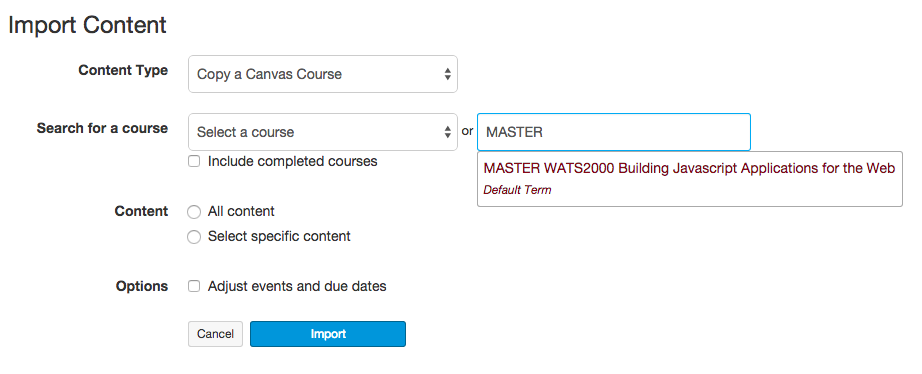

[Home](http://milesccoleman.com/DICE_Instructor_Handbook/)
# Preparing Courses

When you get into your course for the first time, you will see an empty course shell. If this is your first time teaching, you should ask the program director to populate this empty course with the appropriate course content. In order to prepare your course for students, you will need to make sure that the appropriate content is populated into the course. Then, you'll need to complete an audit checklist.

It's very important to be conscientious about looking for issues in the course before you publish it for student access. Although you can always fix issues that are noticed later (and you're expected to fix issues and notify the program director whenever they come up; see below), it's best to avoid issues in the first place. Encountering broken content or bad information in a course can ruin the experience for our students.

**Please Note**: The Course Prep process should happen **1-2 weeks before the quarter starts**. If there are issues completing any of the preparation steps, please contact the DICE Program Director.

## Step One: Copy the Course (ONLY FOR INSTRUCTORS WHO HAVE DEVELOPED THE ORIGINAL CONTENT)
To copy the master course into your course, complete the following steps:

First, Go to the Settings page in the course

Then, Click the link in the upper right that says "Import Course Content"

You will be presented with a drop-down menu. Select "Copy a Canvas Course" and search for courses with "MASTER" in their title:

Select the Master copy of the course you are teaching and then select "All Content". Also be sure to select the "Adjust events and due dates" checkbox.

## Step Two: Invite the Support Team
For some courses it may be beneficial to have observers or helpers who can assist you with different tasks. Be sure to invite these people using the `+ People` button on the People page of the course.

If this is the first course you're teaching for DICE, you must invite the DICE Program Director into your course as a Teacher.

## Step Three: Pre-Course Checklist
Complete the following checklist every time you copy a course into a new instance.

* Open the Assignments page and review the due dates for all assignments. Adjust due dates to appropriately track along with the current term's start and end dates. 
* Update the instructor information (e.g., name, office hourse, email). DICE Instructors are required to give at least two hours of office hours a week. These hours should be schedule just before, or just after, your course period. 
* Review the Home page and verify that all of the links go to the proper Introduction page.
* Open the Modules page and click through every piece of content in the course using the "Next" button. On each page, verify the following:
    * Check every link on the page to verify it works. (We recommend using a link checker extension in your web browser. [Check My Links](https://chrome.google.com/webstore/detail/check-my-links/ojkcdipcgfaekbeaelaapakgnjflfglf/related?hl=en-GB) is a good one for Chrome.) 
    * Read all of the content of the course to refresh yourself with what the course is teaching.
    * Review the Rubrics on assignment pages to familiarize yourself with the Learning Outcomes stressed in the course.

Write up any issues you have found. In the case of broken links, list the old link, what Module it was in, and, if at all possible, a proposed replacement. Ultimately, you'll be responsible for updating the links in your copy of the course, so the faster you can identify replacements, the faster you can get your course properly set up.

## Step Four: Publish!
If you've completed your work on the course, Publish it! The Publish button is on the Home page of the course. Once you click Publish, students can access the course pages. If your course is NOT published, then students cannot access it.

## Step Five: Sign Up for, and Create a Slack "Channel"
In DICE we use Slack as a central communication hub. To use it, you will need to go to [SU DICE Slack Team](https://dtac-program.slack.com). You can sign-up directly with your Seattle University email. Once you have signed up for the Slack Team, create a channel for your course. See instructions [here](https://get.slack.help/hc/en-us/articles/201402297-Create-a-channel). Your channel should be named in accordance to your course code and term (e.g., DICE_4020_Fall_2018). 

IMPORTANT: Under no circumstances are you to give evaluative feedback, grade information, or to discuss personally identifiable information via Slack. Slack is only for student discussions, and for ease of access to instructors for guidance. Grades, and any other [FERPA](https://www2.ed.gov/policy/gen/guid/fpco/ferpa/index.html) protected information should be given only via Canvas, and only directly to the student for whom that information is attached. 

## Step Six: Welcome Video & Message
Once you have the course prepped, you should create a welcome video that gives the students an overview of the course objectives, assignments, and schedule. Teach them how to use the course website and familiarize them with an explanation of what they can expect from week to week. Post it at the top of the Home page as a bold link: "Start Here." 

As well as posting a video, you should send students a welcome message via Seattle University email. You can locate student emails from "My SU" --> "Class Roster" --> "Email" column in course roster. MAKE SURE TO LIST STUDENTS AS BCC, NOT CC. Also BCC the DICE Program Director on this email. 

In your welcome email, introduce yourself, provide the Canvas course link, a quick overview of what they should have completed the first week, a link to your course's Slack channel, and (if applicable) a schedule of all face-to-face meetings for the term. 

Note: You will repeat a simliar process for every week thereafter, just without the welcome email component. 

## Step Seven: Sync with Program Director
Once you've got your course up and running, send an email to the Program Director describing how the process went and any concerns you have with the course. Let the Program Director know that the students have been alerted and the course is published.
